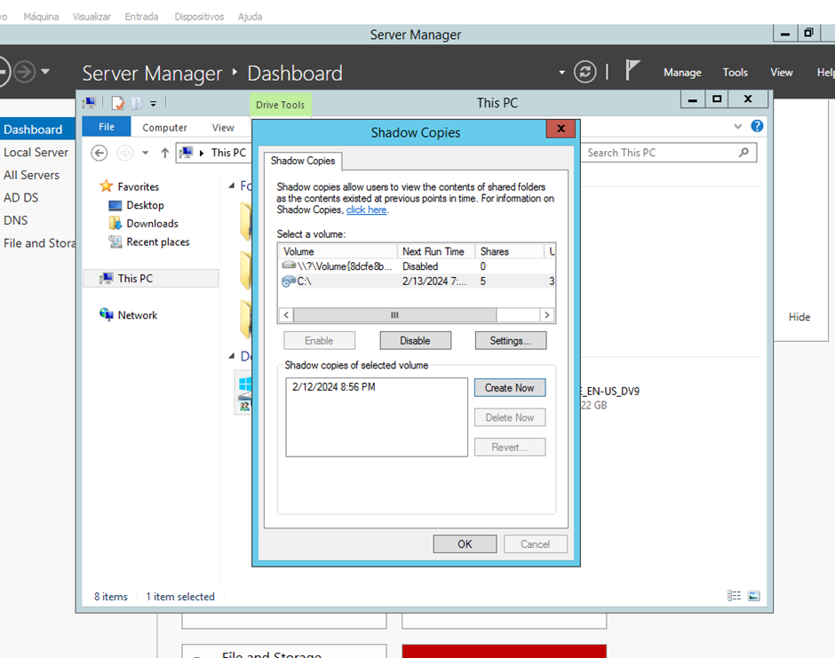
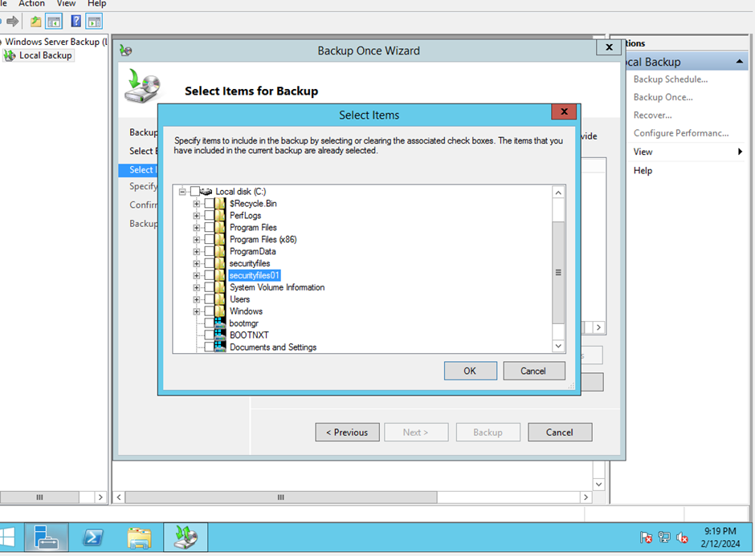

# ActiveDirectory
## Implementação e configuração do Active Directory

A execução da implementação e configuração do Active Directory é crucial para estabelecer um ambiente de rede eficiente. Este guia fornece um passo a passo, demonstrando como criar o primeiro usuário, grupo e pasta de rede, além de abordar conceitos como shadow copies e backup nativo do Windows Server. O ambiente utilizado é baseado no Windows Server 2012, e o link para a configuração está disponível em: [https://github.com/gabrielsecinfo/WindowsServerAD.git](https://github.com/gabrielsecinfo/WindowsServerAD.git)

A criação do primeiro usuário é bem simples, clique com o botão direito em cima da pasta user, depois vá em new > user. Após aparecer a tela, você irá preencher o primeiro nome, inicial e último nome e qual seria o logon.

Conforme o avançar, irá solicitar uma senha para esse usuário e vai aparecer opções como:
- Senha nunca expira
- Conta desativada
- Usuário não pode mudar a senha
- Senha a ser alterada no próximo logon

O usuário como teste foi criado normalmente, como a seguinte imagem demonstra:

A configuração do mesmo é feita em suas propriedades, no qual caminho seria botão direito > propriedades.

Nessas propriedades tem diversas opções como sessões, organizações, seu perfil, seu perfil de acesso remoto, quais grupos você é membro, etc.

Na guia de membros, iremos adicionar um grupo, ao qual será aberto um menu e um campo para digitar o nome do grupo (um objeto que exista). No exemplo, será usado o grupo de administrador:

Demonstrando os grupos que faço parte:

Agora, a criação do grupo, que é muito importante, pois o grupo fornece variações de permissões e, mais importante, segurança, controlando o acesso a sites, permissões de acesso a pasta de rede, VPN, etc.

Obs: O tipo de grupo utilizado é de segurança, porém o de distribuição seria mais para e-mails.

Estrutura:

Agora, subindo outra VM com Windows 10 para ser colocada no domínio e acessar uma conta que já está criada no AD;

Ao iniciar, vamos entrar no perfil do administrador e assim colocá-lo no domínio. Quando estiver na tela de área de trabalho, use o atalho Win+R, escreva ncpa.cpl e pressione Enter. Ative os adaptadores e, após, vá em propriedades e dê dois cliques no IPv4. Podemos configurá-lo para deixar no DHCP e configurar somente o DNS para o Windows Server.

Configurando o computador para o domínio:
Win+R, escreva sysdm.cpl e pressione Enter. Ao entrar, vá em alterar e depois selecione domínio e coloque o domínio criado anteriormente. Após terminar, será pedido para reiniciar.

Ao reiniciar, você já pode usar um usuário de rede. Se observar a imagem, tem a opção de entrar em: GABRIELSECURITY (Domínio).

Voltando no Windows Server 2012 R2, podemos criar uma pasta compartilhada via rede. Então criamos a pasta securityfile e fomos em propriedades > compartilhamento > compartilhamento avançado (advanced sharing), selecionando a opção de compartilhar essa pasta. Ao ir em permissions, podemos adicionar usuário e sua permissão como: acesso total, leitura, escrita, etc.

E para melhorar o ambiente para o usuário, criamos uma pasta de rede para o próprio usuário, então toda vez que o mesmo entrar, vai subir uma pasta de rede do usuário dele. Vamos em users no AD > Propriedades > Profile e tem a opção de se conectar a uma unidade de rede e o local da pasta. Ao adicionar e a pessoa logar pela primeira vez, deverá subir o sistema da pasta.

Código: \\server\pasta$\%username%

Agora, iremos configurar Shadow Copies. Vamos em Este Computador > seu disco > botão direito > shadow copies.

Vamos em settings para podermos inserir a quantidade de cota das shadow copies. Depois de aplicar, já está como enable, podemos apertar no botão de create now.

Criei um arquivo teste.txt de teste, porém o arquivo só será feito o shadow copie dele às 7 horas da manhã, pois o horário foi setado.

Iremos criar de novo, após ter sido excluído o mesmo. Então voltamos ao C:/ e fomos até propriedades > versões anteriores, o que mostra toda vez que a função do shadow copies foi efetuada e que possa retornar a ela.

Selecionamos a data/hora na qual o arquivo não estava excluído e vamos em abrir/open.

Como por redundância e questões de segurança, iremos criar um sistema de backup nativo do Windows Server. Vamos criar um novo recurso a partir do wizard, onde o caminho seria abrir o Server Manager > Dashboard > Next até Features/Recursos, selecionar backup do Windows Server e instalar.

Ok, já instalado, você irá abrir Ferramentas > Backup do Windows Server. Agora, iremos em opções de backup/backup once/backup único.

Colocamos em opções diferentes.

A seleção de configuração de backup foi colocada em custom/personalizado.

Então, na próxima etapa, escolhemos o item que deverá ser feito o backup.

Agora, para finalizar, só avançar até confirmação e realizar o backup.
